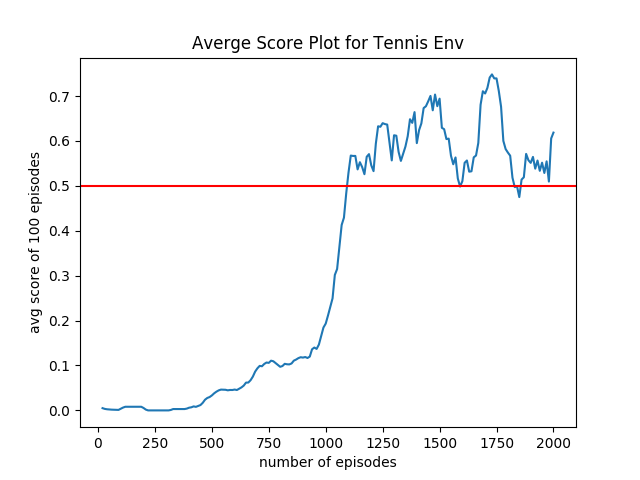

# Tennis Environment

### Description 

This repository contains the code to train the reinforcement learning agent to learn the double agent tennis environment. 
It uses multi agent ddpg method and 3 layer neural network to model the agent. The code base is written in python and pytorch. 

### State Description 

The state space has 8 dimensions which contain the information regarding the agent's current environment.  Given this information, the agent has to learn how to best select actions.  Each action is a 2 dimensional vecotr, corresponding to movement toward (or away from) the net, and jumping.

### Instruction:
1. Download the environment from [this link](https://s3-us-west-1.amazonaws.com/udacity-drlnd/P3/Tennis/Tennis_Linux_NoVis.zip)
2. Fix the env path in `main.py`
3. Run 
    ```sh  
    $ python main.py
    ```
4. optionally run `create_plot.py` to create the reward plot.

### Result
- The environment solved using ddqg.
    - gamma 0.99 
    - tau 5e-3 
    - lr_actor=1e-3 
    - lr_critic=1e-3
    - n_updates 10
    - update_intervals 20
    
###  Score plot: 
It is considered to be solved after 1100 epochs

   